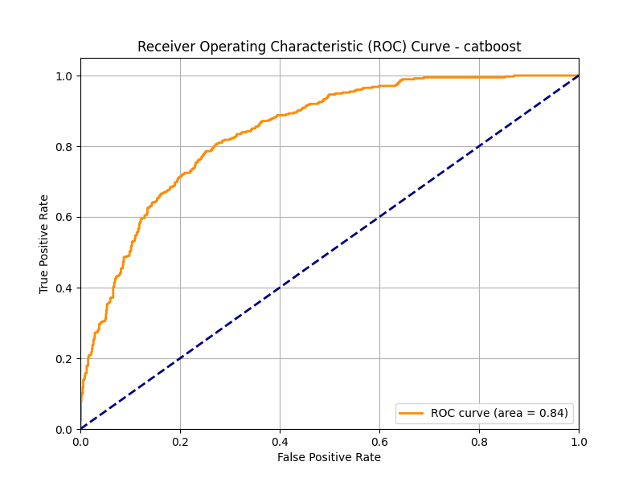
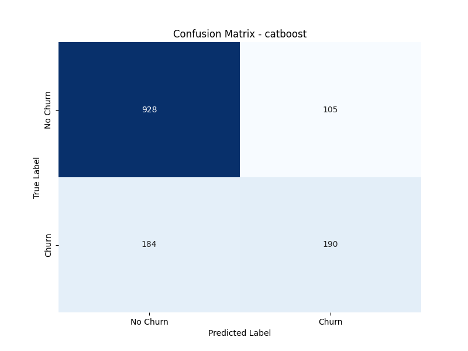

# Customer Churn Prediction Model Performance Report

**Date:** 2025-06-24 10:16:28
**Best Model:** catboost
**Dataset:** Telco Customer Churn (cleaned, preprocessed, and split into train/test)

---

## 1. Introduction

This report summarizes the performance of the best machine learning model selected for predicting customer churn. The primary objective is to identify customers at risk of churning to enable proactive retention efforts.

The model was trained and evaluated on the Telco Customer Churn dataset, which includes various customer demographics, services, and account information.

## 2. Model Overview

The best-performing model identified through hyperparameter tuning and cross-validation was a **catboost**.

This model was chosen based on its balanced performance across key metrics, particularly its ability to identify churners (Recall) while maintaining acceptable precision and a high ROC AUC score.

## 3. Evaluation Metrics

For this classification task, especially given potential class imbalance (fewer churners than non-churners), the following metrics were prioritized:
- **Accuracy:** Overall correctness of predictions.
- **ROC AUC (Receiver Operating Characteristic Area Under Curve):** Measures the model's ability to distinguish between positive and negative classes across all possible classification thresholds.
- **Precision:** The proportion of positive identifications that were actually correct.
- **Recall (Sensitivity):** The proportion of actual positives that were identified correctly.
- **F1-Score:** The harmonic mean of Precision and Recall, providing a balance between the two.

## 4. Performance Results

### Key Metrics

- **Overall Accuracy:** `0.7946`
- **ROC AUC Score:** `0.8423`

### Classification Report (Test Set)

```
              precision    recall  f1-score   support

    No Churn       0.83      0.90      0.87      1033
       Churn       0.64      0.51      0.57       374

    accuracy                           0.79      1407
   macro avg       0.74      0.70      0.72      1407
weighted avg       0.78      0.79      0.79      1407

```
**Key Observations from Classification Report:**
- The model shows strong performance in identifying non-churners (Class 0), with high precision, recall, and F1-score.
- For churners (Class 1), the model achieved a **Recall of 0.51** (meaning it identified 51% of actual churners) and a **Precision of 0.64** (meaning 64% of its churn predictions were correct).
- This balance indicates that the model is effective for targeted retention efforts, balancing the need to find churners with minimizing false alarms.

### Visualizations

#### ROC Curve



The ROC curve further illustrates the model's discriminative power. The closer the curve is to the top-left corner, the better the model performs across various thresholds.

#### Confusion Matrix



The confusion matrix provides a detailed breakdown of correct and incorrect predictions:
- **True Negatives (TN):** 928 (Correctly predicted no churn)
- **False Positives (FP):** 105 (Incorrectly predicted churn - Type I error)
- **False Negatives (FN):** 184 (Incorrectly predicted no churn, but they churned - Type II error, critical for churn)
- **True Positives (TP):** 190 (Correctly predicted churn)

## 5. Conclusion & Recommendations

The **catboost** model provides a solid foundation for predicting customer churn. Its performance indicates a strong ability to identify at-risk customers, allowing for strategic interventions.

### Recommendations:
- **Targeted Interventions:** Utilize the model to identify customers predicted to churn and implement specific retention campaigns.
- **Feature Importance Analysis:** Further analyze the model's feature importances (if available from the best model) to gain business insights into the main drivers of churn and inform product/service improvements.
- **Monitoring:** Continuously monitor model performance in a production environment for data drift and concept drift.

### Future Work:
- Explore advanced feature engineering techniques.
- Implement A/B testing of retention strategies based on model predictions.
- Integrate the model into a real-time prediction service.

